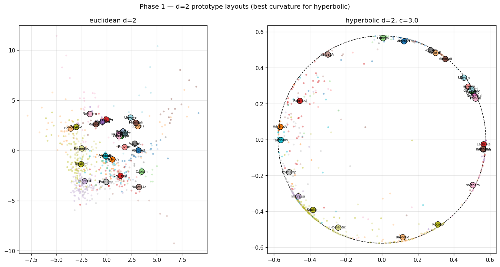

# Hyperbolic Embeddings for Hierarchical Style Representation

> **TL;DR.** Use Euclidean if you care about labels. Use hyperbolic if you care about trees. We sweep 150 seed-replicated runs across geometry, dimension, curvature, and a hierarchy-aware loss to show that the choice between Euclidean and Poincaré-ball embeddings of artistic style is a real, robust trade-off — not a free lunch on either side.

📄 **Read the paper:** [`docs/main.pdf`](docs/main.pdf) (course version) · [`docs/arxiv/main.pdf`](docs/arxiv/main.pdf) (preprint version, no course metadata)
🧪 **Reproduce in a notebook:** [`notebooks/ms4_main.ipynb`](notebooks/ms4_main.ipynb)
📊 **Inspect the data:** [`notebooks/sweep_results.csv`](notebooks/sweep_results.csv) — every config × every metric, 150 rows

<p align="center">
  
</p>

*Trained at d=2: hyperbolic prototypes (right) settle into a near-boundary ring — exactly where the exponential-volume regime lives — while Euclidean prototypes (left) scatter without structural pressure. The geometry is doing what theory predicts. The question is whether that geometric difference shows up in the metrics that matter for downstream tasks.*

---

## What this project asks

Artistic style is hierarchical. Renaissance branches into Baroque, Baroque into Romanticism, Impressionism into Cubism. An embedding that respects this branching should be more useful for tasks like influence-aware retrieval, museum-catalog browsing, or pedagogical tools that organize collections by lineage rather than raw visual similarity.

Standard image embeddings live in $\mathbb{R}^d$ where the volume of a ball at radius $r$ grows polynomially. A tree's leaf count grows exponentially with depth. Forcing tree-like data into Euclidean coordinates therefore distorts pairwise distances, and the distortion widens as the tree deepens. The Poincaré ball, with its own exponential volume growth, embeds trees with provably lower distortion ([Nickel & Kiela 2017](https://arxiv.org/abs/1705.08039); [Sala et al. 2018](https://arxiv.org/abs/1804.03329)).

**The question:** does that mathematical advantage translate into an empirical one for representing artistic style?

## What we found

| | **Euclidean** | **Hyperbolic** | Winner |
|---|---:|---:|:---:|
| Top-1 accuracy | 65.9% ± 0.0 | 60.6% ± 0.2 | Eu |
| Top-5 accuracy | 96.3% ± 0.0 | 93.5% ± 0.1 | Eu |
| Class-center / tree Spearman | 0.332 ± 0.003 | 0.242 ± 0.002 | Eu |
| Mean tree distortion (lower is better) | 1.760 ± 0.003 | 1.861 ± 0.003 | Eu |
| Dendrogram-cluster F1 | 0.051 | 0.000 | Eu |
| **Sibling recall@5** | 0.142 ± 0.002 | **0.188 ± 0.004** | **Hy** |
| **Cousin recall@5** | 0.258 ± 0.002 | **0.296 ± 0.005** | **Hy** |

Euclidean wins on classification and on global tree fidelity. Hyperbolic wins on *local* hierarchy structure — the nearest neighbors of a Cubist painting are more often Cubist (or Cubism-adjacent) when the embedding lives in the Poincaré ball. Critically, **the gap on sibling recall widens as embedding dimension grows** (5pp by d=64), so the hyperbolic local advantage is not just a small-d artifact.

A hierarchy-aware regularizer that pushes the prototype distance matrix toward the tree distance matrix improves global tree metrics in both geometries, but **does not flip the winner** on either axis at any value of $\lambda$. We retrained against three different ground-truth trees (default lineage, chronological, flat null) and the conclusion holds. Geometry choice is a knob with a clear trade-off, not a hyperparameter to tune to a single optimum.

Full numbers, plots, and discussion are in [the paper](docs/main.pdf).

## What's in the repo

```
docs/
  main.tex          ← course version (Canvas project, group, etc.)
  main.pdf
  arxiv/
    main.tex        ← preprint version (no course metadata, with repo link)
    main.pdf
  sections/         ← shared between both versions via \ifarxiv switch
    background.tex  problem.tex  data_eda.tex  methods.tex
    results.tex     conclusion.tex  broader_impact.tex  appendix.tex
  preamble.tex
  references.bib
  figures/          ← all 8 figures (Poincaré disks, scaling curves,
                      lambda sweep, tree-variant ablation, confusion,
                      kNN grids, headline-results table)

scripts/
  models.py         ← MLP head + EuclideanHead + PoincareHead +
                      ClassifierLayer + Poincaré utilities
  hierarchy.py      ← STYLE_HIERARCHY (lineage, chronological, flat) +
                      tree-distance matrix
  dataset.py        ← FeatureDataset over cached CLIP features
  train.py          ← training loops with optional hierarchy-aware loss
                      (`tree_loss_weight`, `tree_hierarchy`)
  eval.py           ← run_evaluation() returns the full metric dict;
                      CLI also writes per-run artifacts to disk
  sweep.py          ← grid-search runner with 3 predefined phases;
                      resumable via single sweep.csv keyed on config hash
  analysis.py       ← sweep loading, summarize_by_config,
                      best_per_geometry_dim, plot_scaling,
                      plot_lambda_sweep, plot_poincare_disk,
                      plot_confusion_block_tree, plot_knn_image_grid,
                      headline_table
  make_figures.py   ← regenerates docs/figures/* from sweep.csv

notebooks/
  ms2_data_wrangling.ipynb   ← original EDA
  ms3.ipynb                  ← baseline modeling milestone
  ms4_main.ipynb             ← main MS4 notebook (TOC, end-to-end
                               reference run, analysis cells loading
                               sweep_results.csv, qualitative figures)
  sweep_results.csv          ← 150-row snapshot for graders
```

## Reproduce the headline number in one cell

The cached CLIP features are 512-d float16 tensors, so a single training run takes ~10 seconds on an Apple-Silicon GPU. The full sweep finishes in under half an hour.

```bash
# (assuming setup from "Setup" below is done)
python scripts/sweep.py --phase 1 --device mps   # ~14 min, 90 configs
python scripts/sweep.py --phase 2 --device mps   # ~10 min, 48 configs
python scripts/sweep.py --phase 3 --device mps   # ~3 min, 18 configs
python scripts/make_figures.py                    # regenerates docs/figures/*
```

The sweep is resumable via a single `data/runs/sweep.csv`. Each row is one (geometry, dim, curvature, λ, training tree, seed) configuration plus every evaluation metric we report. If the run dies halfway, re-running picks up where it left off.

For the grader-friendly version, open [`notebooks/ms4_main.ipynb`](notebooks/ms4_main.ipynb) and choose **Restart Kernel + Run All**. Section 4 trains a single Euclidean and a single hyperbolic model from scratch (~1 min) so that the executable pipeline is verified; later sections load `notebooks/sweep_results.csv` and produce all the report figures.

## Setup

Requires Python 3.12+, ~25 GB of disk for WikiArt images.

```bash
# 1. Clone
git clone https://github.com/pgrindehollevik-harvard/hyperbolic.git
cd hyperbolic

# 2. Virtual env
python3.12 -m venv .venv
source .venv/bin/activate

# 3. Dependencies (PyTorch, geoopt for Riemannian optimization, OpenCLIP, sklearn, matplotlib)
pip install -r requirements.txt

# 4. Jupyter kernel
python -m ipykernel install --user --name=hyperbolic --display-name="Python (hyperbolic)"

# 5. Dataset (~25 GB images + metadata CSVs)
pip install gdown
gdown "1vTChp3nU5GQeLkPwotrybpUGUXj12BTK" -O data/wikiart.zip
gdown "1uug57zp13wJDwb2nuHOQfR2Odr0hh1a8" -O data/wikiart_csvs.zip
unzip data/wikiart.zip -d data/wikiart
unzip data/wikiart_csvs.zip -d data/wikiart_csvs

# 6. CLIP feature extraction (one-time, ~30 min on a GPU). Outputs:
#    data/features/clip_vitb16.npy  -- (N, 512) float16
#    data/features/index.csv        -- row_idx, path, style_name
python scripts/extract_clip_features.py
```

## How the hierarchy-aware loss works

The MS3 baseline (and most prior hyperbolic-image work) uses the tree only at evaluation time. Cross-entropy on prototypes only requires that classes be separable; it never asks for the prototype layout to mirror the tree. So we can't fairly blame the geometry for failing on tree metrics if the loss never asked for it.

For MS4 we add a single-term regularizer that pushes the prototype distance matrix toward the tree distance matrix:

$$\mathcal{L} = \mathcal{L}_{CE} + \lambda \cdot \frac{1}{|\mathcal{P}|} \sum_{(i,j) \in \mathcal{P}} \left( \frac{d(p_i, p_j)}{\bar{d}} - \frac{T_{ij}}{\bar{T}} \right)^{\!2}$$

Each pair-distance vector is divided by its own mean before the squared difference, so the loss only constrains the *shape* of the prototype distance matrix rather than its absolute scale. The geometry picks the scale that classification likes. $\lambda = 0$ recovers the cross-entropy baseline exactly. Implementation: [`scripts/train.py`](scripts/train.py) (`tree_regularizer` function).

## Key references

| Paper | Link |
|---|---|
| Poincaré Embeddings for Learning Hierarchical Representations (Nickel & Kiela, NeurIPS 2017) | [arXiv 1705.08039](https://arxiv.org/abs/1705.08039) |
| Hyperbolic Neural Networks (Ganea et al., NeurIPS 2018) | [arXiv 1805.09112](https://arxiv.org/abs/1805.09112) |
| Representation Tradeoffs for Hyperbolic Embeddings (Sala et al., ICML 2018) | [arXiv 1804.03329](https://arxiv.org/abs/1804.03329) |
| Hyperbolic Image Embeddings (Khrulkov et al., CVPR 2020) | [arXiv 1904.02239](https://arxiv.org/abs/1904.02239) |
| From Trees to Continuous Embeddings and Back (Chami et al., NeurIPS 2020) | [arXiv 2010.00402](https://arxiv.org/abs/2010.00402) |
| Geoopt: Riemannian Optimization in PyTorch (Kochurov et al., GRL+ Workshop 2020) | [arXiv 2005.02819](https://arxiv.org/abs/2005.02819) |
| CLIP: Learning Transferable Visual Models from Natural Language Supervision (Radford et al., ICML 2021) | [arXiv 2103.00020](https://arxiv.org/abs/2103.00020) |
| Improved ArtGAN (Tan et al., IEEE TIP 2019) — original WikiArt-Refined dataset | [arXiv 1708.09533](https://arxiv.org/abs/1708.09533) |

## Authors

**Peter Flo (Grinde-Hollevik)** · [pgrindehollevik@g.harvard.edu](mailto:pgrindehollevik@g.harvard.edu) · [www.pflo.org](https://www.pflo.org)
**Luca Grossmann**
**Valerie Wang**

Harvard COMPSCI 209B, Spring 2026.
